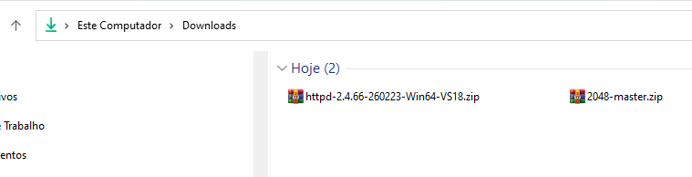
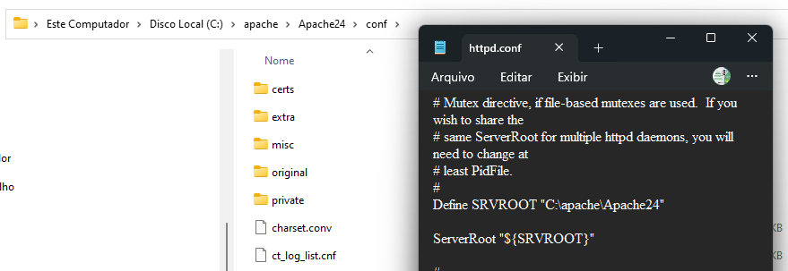
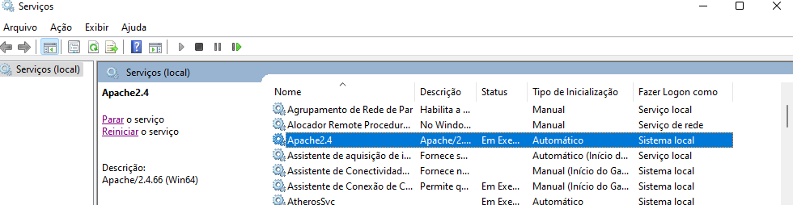
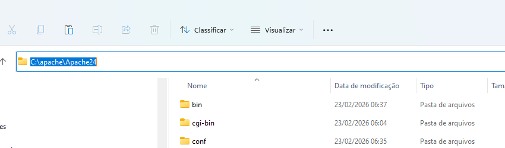

# Relatório de Deploy de Jogo no Apache (Windows)

## 1. Introdução

Este relatório detalha o processo de deploy de um jogo web no servidor Apache, em um ambiente Windows, conforme a atividade proposta pela diretoria de Qualidade da Ecomp. O objetivo principal foi disponibilizar um jogo web para acesso local via `localhost`, utilizando o servidor Apache. O processo foi executado **manualmente, seguindo um tutorial passo a passo**, e foi facilitado por conhecimentos prévios sobre configuração de servidores web e sistemas operacionais Windows, resultando em um deploy bem-sucedido e sem intercorrências.

## 2. Ferramentas e Ambiente

Para a realização desta atividade, foram utilizadas as seguintes ferramentas e configurado o ambiente conforme descrito:

- **Sistema Operacional:** Windows 10/11

- **Servidor Web:** Apache HTTP Server (versão 2.4, instalado e configurado previamente)

- **Jogo Selecionado:** 2048 (código-fonte obtido via GitHub)

- **Ferramentas Auxiliares:** Navegador web (para verificação), explorador de arquivos do Windows.

## 3. Processo de Deploy (Passo a Passo)

O processo de deploy seguiu as etapas fundamentais para a publicação de conteúdo em um servidor Apache, garantindo que o jogo estivesse acessível localmente. Cada passo foi executado manualmente, conforme as instruções do tutorial.

### 3.1. Seleção e Preparação do Jogo

Foi selecionado o jogo **2048** para o deploy, devido à sua simplicidade e à natureza estática de seus arquivos, o que facilita a hospedagem em um servidor web básico. O código-fonte do jogo foi obtido através do link fornecido na atividade:

> [2048 - GitHub Repository](https://www.google.com/url?q=https://github.com/gabrielecirulli/2048/archive/master.zip)

Após o download, o arquivo `.zip` foi descompactado em um diretório temporário, revelando a estrutura de arquivos HTML, CSS, JavaScript e recursos gráficos do jogo.

**Captura de Tela 1: Download e Descompactação do Jogo e Servidor**

### 3.2. Identificação

### do DocumentRoot do Apache

O `DocumentRoot` do Apache é o diretório onde o servidor busca os arquivos a serem servidos. No ambiente Windows, a localização padrão para instalações típicas do Apache 2.4 é `C:\Apache24\htdocs`. Esta localização foi confirmada através da análise do arquivo de configuração `httpd.conf` do Apache, onde a diretiva `DocumentRoot` aponta para o caminho especificado.

**Captura de Tela 2: Localização do DocumentRoot no \*\***`httpd.conf`\*\*

### 3.3. Cópia dos Arquivos do Jogo

Os arquivos descompactados do jogo 2048 foram copiados para o `DocumentRoot` do Apache. Para garantir que o jogo fosse a aplicação principal acessível via `localhost`, o conteúdo existente no `htdocs` (geralmente uma página `index.html` padrão do Apache) foi removido, e os arquivos do jogo foram então transferidos para lá. Isso assegura que, ao acessar o endereço base do servidor, o jogo seja carregado diretamente.

**Captura de Tela 3: Conteúdo do \*\***`htdocs`\***\* antes da cópia**

**Captura de Tela 4: Conteúdo do \*\***`htdocs`\***\* após a cópia dos arquivos do jogo**

### 3.4. Reinício do Serviço Apache

Para que o Apache reconhecesse os novos arquivos e começasse a servi-los, foi necessário reiniciar o serviço. Isso foi realizado através do Gerenciador de Serviços do Windows, garantindo que todas as configurações e arquivos fossem recarregados corretamente.

**Captura de Tela 5: Reinício do Serviço Apache via Gerenciador de Serviços**

### 3.5. Verificação do Deploy

Após o reinício do serviço, um navegador web foi aberto e o endereço `http://localhost` foi acessado. O jogo 2048 foi carregado e funcionou conforme o esperado, confirmando o sucesso do deploy.

**Captura de Tela 6: Jogo 2048 funcionando em \*\***`http://localhost`\*\*

**Captura de Tela 7: Verificação Final do Ambiente**

## 4. Boas Práticas de Qualidade e Aprendizados

O processo de deploy, embora manual e guiado por um tutorial, reforça a importância de diversas boas práticas de Qualidade no contexto de deploy e manutenção de software:

- **Documentação Clara:** A necessidade de um relatório detalhado, mesmo em um deploy simples, sublinha a importância de documentar cada etapa, configurações e decisões. Isso serve como um guia para futuras implantações e para a resolução de problemas.

- **Seguir Tutoriais e Guias:** A capacidade de seguir instruções detalhadas de um tutorial é fundamental para a execução precisa de tarefas técnicas, garantindo a conformidade com os procedimentos estabelecidos.

- **Controle de Versão:** Embora não explicitamente parte do deploy em si, a obtenção do código-fonte via GitHub destaca a importância do controle de versão para gerenciar o código-fonte e facilitar a colaboração e o deploy de diferentes versões.

- **Testes e Verificação:** A etapa final de verificar o acesso ao jogo via navegador é crucial. Testar a funcionalidade após o deploy garante que a aplicação está operando como esperado e que não houve falhas durante o processo.

- **Gerenciamento de Configuração:** A identificação e manipulação do `DocumentRoot` e outros arquivos de configuração do Apache são exemplos de gerenciamento de configuração, uma prática vital para manter a consistência e a rastreabilidade das configurações do ambiente.

## 5. Conclusão

O deploy do jogo 2048 no servidor Apache em ambiente Windows foi concluído com sucesso, demonstrando a capacidade de configurar e gerenciar um servidor web para hospedar aplicações estáticas. A atividade serviu como um excelente exercício prático para aplicar conceitos de deploy e reforçar a importância das boas práticas de Qualidade, como documentação e a execução cuidadosa de procedimentos, no ciclo de vida do desenvolvimento de software.

## 6. Referências

[1]: https://www.google.com/url?q=https://github.com/gabrielecirulli/2048/archive/master.zip "Jogo 2048 - Repositório GitHub:"
[2]: https://httpd.apache.org/docs/ "Documentação Oficial do Apache HTTP Server:"
